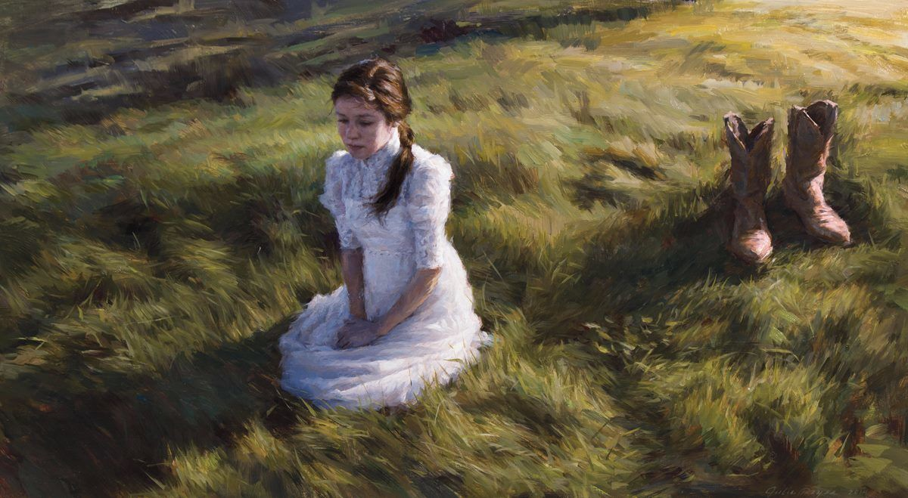

# **Сапоги мертвеца**
### **Король и Шут**

>Пьяный дровосек тащился по лесу\
>Встали у него вдруг дыбом волосы\
>Увидел он мертвеца в траве некошеной\
>В новых сапогах, почти не ношенных\
>"Эх, я возьму их себе\
>Как они будут на мне?"

>И пришёл он радостный домой\
>"Поскорей, сестра, мне дверь открой!\
>Посмотри что на моих ногах\
>Посмотри, в каких я сапогах!"

>Радуется брат\
>Сестра тревожится\
>Наступает ночь - она все молится\
>"Не могу уснуть, болит головушка!\
>Принесёт беду твоя обновушка\
>Зря братец снял сапоги\
>С мертвой холодной ноги!"

>И раздался голос за окном\
>"Открывай мужик мне дверь добром!\
>Я пришёл обратно получить\
>То, что смел ты утром утащить!"

>И раздался голос за окном\
>"Открывай мужик мне дверь добром!"\
>А мужик схватился за топор\
>И проворно выбежал во двор\
>Дровосек избегал все вокруг\
>Никого не встретил он и вдруг\
>Вдруг увидел дома на полу\
>В сапогах убитую сестру\
>Хей! О-о-о-оо
___

Авторы: Король и Шут, А. Князев, М. Горшенев
___
Источник: Musixmatch
___